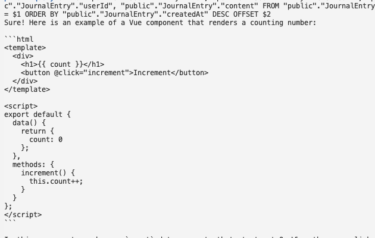
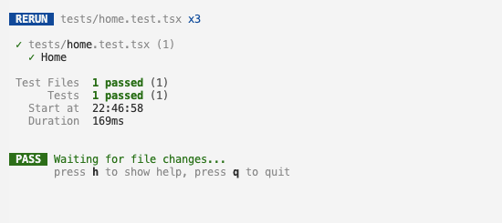

# AI-App
This's an app you can write your entries. By AI power, it can tell you what the mood of your journal entry is. And it would try to analysis what you were feeling, saying, how you feel that day(pos or neg).

U can ask it, how i felt that day? Was i in a bad mood this month?... AI will give you answer.

We don't need to know anything about the ai algorithm, just need to know how to call the api of openAI.

项目使用丰富的全栈技术栈
- nextjs
- 加密算法对.env文件加密
- serveless数据库，orm数据库管理工具
- openai、prompt工具

## Crypto Env
I use crypto to upload env variables, `npm run gen` to generate env variable. 

- 通过将【密码】做hash(使用`id`)生成`SigningKey`【私钥】
- 使用`id`生成【消息摘要】
- 用【私钥】对【消息摘要】做签名，生成【地址】，使用`recoverAddress`
- 【地址】用于验证密码是否正确，【地址】明文保存
- 用【对称加密】恢复环境变量文件

**File: gen_env.js**

```javascript 
/// ...
    const key = new SigningKey(id("private-key"));
    const digest = id("private-key");
    const sig = key.sign(digest).serialized;
    const address = recoverAddress(digest, sig);
    if (address === VERIFY_ADDRESS) {
        if (answers.mode === 'encrypt') {
            cipher_file("private-key");
        } else {
            decipher_file("private-key");
        }
    } else {
        console.error("Invalid password");
    }
/// ...
```

## Database Server
[Neon](https://console.neon.tech/app/projects)

if don't have `neonctl` need to install it `npm install -g neonctl`

## Database ORM
[Prisma](https://www.prisma.io/)

# Setup
`npm install`


# Run
`npm run dev`

# Logs

### ...
**project setup**

- serveless database: neon
- databse orm: prisma
- auth: clerk
- log in/sign up logic

### ... 

### 2024-10-19

**building the journal page**

- new user
- creating the journal page
- user profile widget from clerk
- journal entry ui

**creating & updating journal entries**

- api call
- new entry component
- entry card component

### 2024-10-22

- entry page
- entry detail query
- auto save

### 2024-10-23

ai part
- side bar
- LLM & Prompts


### 2024-10-24

prompt {schema}

schema library `zod`

`StructuredOutputParser`

### 2024-10-25

prompt engineer

analysis result and responsible to alter content

### 2024-10-26

Vector Database [pinecone]

- in memory Vector database
[open ai blog](https://openai.com/index/introducing-text-and-code-embeddings/)

search API & Results

- Sentiment Analysis

给分析添加用户关系，能直接根据analysis找到用户

修复问题，把Journal页面改成client component，响应切换事件

data visualization

- Writing Test

packages download

test tsconfig

